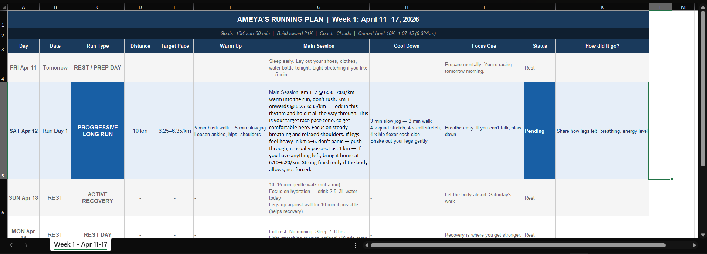

# strava-ai-running-coach
An Agentic AI implementation that transforms raw Strava telemetry into a structured, week-over-week marathon training program.

## 🤖 The Solution
I built a personalized coaching agent using **Claude 4.6** and the **Model Context Protocol (MCP)**. This system moves beyond "chatting" and focuses on **Data Integrity** and **Actionable Deliverables**.

### Key Features:
* **Data Auditing:** I act as the "Human-in-the-loop," performing UAT on the AI’s data summaries. If inaccuracies occur, the agent is prompted to re-query Strava's raw streams for ground-truth verification.
* **Structured Output:** The agent generates a comprehensive weekly training block exported as a formatted Excel spreadsheet.
* **Dynamic Feedback:** Analyzes qualitative feedback (breathing, fatigue) alongside quantitative pace data.

---

## 📊 The Output: Weekly Training Plan and Analysis
Below is an example of the structured training plan generated by the Claude 4.6 agent:



---

### 1. Prerequisites
* **Claude Desktop App:** (Windows or Mac)
* **Strava Account:** You will need to create a [Strava API Application](https://www.strava.com/settings/api)
* **Node.js installed** on your machine.

### 2. Configure the "Bridge" (MCP)
The "Bridge" is the Strava MCP server developed by [r-huijts](https://github.com/r-huijts/strava-mcp). To connect it to Claude:

1. Open your Claude Desktop configuration file: 
   `%APPDATA%\Claude\claude_desktop_config.json`
2. Add the following configuration. **Note:** On Windows, you must use the full path to `npx.cmd` to avoid execution errors.

```json
{
  "mcpServers": {
    "strava": {
      "command": "C:\\Program Files\\nodejs\\npx.cmd",
      "args": ["-y", "@r-huijts/strava-mcp-server"]
    }
  }
}
```

### 3. Get your Strava API Credentials
You need to create a free "bridge" for your data. It takes 2 minutes:
1. Log in to [strava.com/settings/api](https://www.strava.com/settings/api)
2. Create an app (Name it something like "My AI Coach").
3. Category you can choose any.
4. Website: It can be anything (e.g., http://localhost)
5. **Crucial:** Set the "Authorization Callback Domain" to `localhost`.
6. Copy your **Client ID** and **Client Secret**.

### 4. Authorize and Connect
1. Restart Claude Desktop.
2. In a new chat, type: Connect my Strava account
3. Restart Claude Desktop (try doing End Task from Task Manager)
4. Go to file -> Settings -> Developer -> Edit Config (Ensure the config file is opening)
5. Prompt to Claude -> "Connect my Strava Account"
6. A taskbar or browser would open asking for Strava Client ID and Secret ID

### 5. Good to Go!
1. You are connected to Strava through Claude.
2. Use it to analyse your latest runs, trainings, performances, recommendations, coaching and what not!
